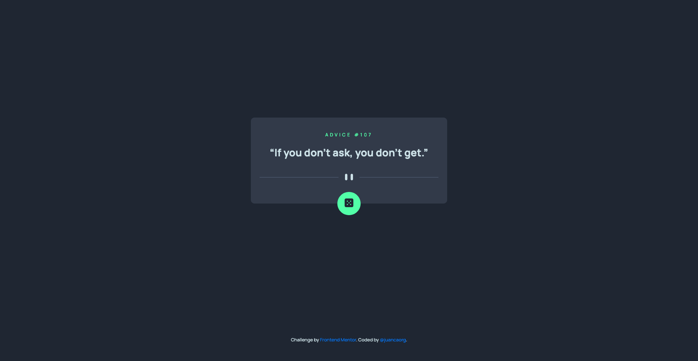

# Frontend Mentor - Advice Generator (Vanilla)

This is a solution to the [Advice generator app challenge on Frontend Mentor](https://www.frontendmentor.io/challenges/advice-generator-app-QdUG-13db). Frontend Mentor challenges help you improve your coding skills by building realistic projects. 

## Table of contents

- [Overview](#overview)
  - [Screenshot](#screenshot)
  - [Links](#links)
- [Built with](#built-with)
- [Author](#author)

## Overview

### Screenshot

### Links

- Solution URL: [GitHub Repository](https://github.com/juancaorg/advice-generator)
- Live Site URL: [advicegenerator.juanca.dev](https://advicegenerator.juanca.dev)

## Built with

- HTML5 
- CSS custom properties
- CSS Flex
- CSS Grid
- Vanilla JavaScript

## Author

- Website - [juanca.org](https://www.juanca.org)
- Frontend Mentor - [@juancaorg](https://www.frontendmentor.io/profile/juancaorg)
- Twitter - [@juancaorg](https://twitter.com/juancaorg)
